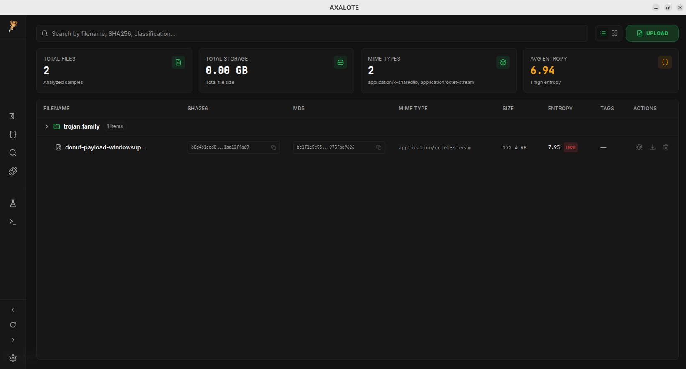
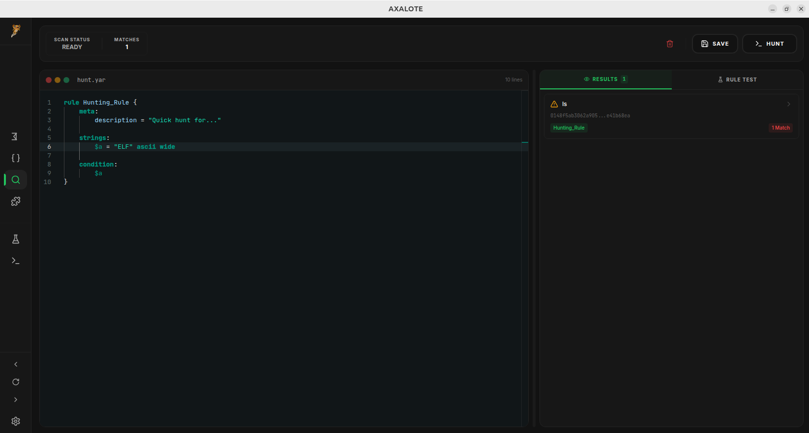

# Axalote Frontend

Modern malware analysis desktop application built with Electron, React, and TypeScript. Provides an intuitive GUI for the Axalote engine with real-time analysis, visualization, and interactive tools for security researchers.



## Features

### File Analysis
- **Upload & Process** - Drag-and-drop file upload with automatic processing
- **Binary Parsing** - View detailed PE, ELF, Mach-O, DEX, and PDF structures
- **Metadata Extraction** - Hash computation (MD5, SHA1, SHA256), entropy analysis, MIME detection
- **Nested File Extraction** - Track parent-child file relationships and recursively extracted samples
- **File Details Views** - Multiple visualization modes (Modern, IDA-style)

### YARA Scanning
- **Interactive Rule Editor** - Code editor with syntax highlighting and diagnostics
- **File Scanning** - Scan individual files against YARA rules
- **Pattern Hunting** - Search for patterns across entire file database
- **Rule Management** - Load, list, and manage YARA rule files
- **Rule Visualization** - View matching rules with pattern details

### String Analysis
- **Encoding Detection** - Support for 7 encoding types (ASCII, UTF-8, UTF-16LE/BE, UTF-32LE/BE, WIDE)
- **IOC Detection** - Automatic detection of IPv4, IPv6, URLs, domains, and email addresses
- **Filtering & Export** - Configurable filters with data export capabilities
- **Visualization** - Interactive charts and statistics

### Advanced Analysis
- **Code Deobfuscation** - Deobfuscate JavaScript and other languages
- **Threat Intelligence** - VirusTotal integration for hash lookups and reports
- **Artifact Management** - Save, organize, and annotate analysis artifacts
- **Terminal Access** - Direct command-line interface for advanced operations

### Workflow Tools
- **Lab Environment** - Sandbox for experimenting with analysis workflows
- **Interactive Diagrams** - Visualize file relationships and analysis flow
- **Real-time Updates** - Live status and progress tracking
- **Multi-tab Interface** - Concurrent analysis of multiple files

## Technology Stack

### Core Framework
- **Electron 30+** - Cross-platform desktop application
- **React 18** - Modern UI component framework
- **TypeScript** - Type-safe development
- **Vite** - Next-generation build tool

### UI Components & Styling
- **Radix UI** - Accessible component library (28+ components)
- **Tailwind CSS** - Utility-first CSS framework
- **Lucide React** - Icon library (460+ icons)
- **Shadcn/ui** - High-quality component patterns

### Advanced Features
- **Monaco Editor** - Code editor for YARA rules and deobfuscation
- **React Flow** - Interactive diagram visualization
- **Recharts** - Data visualization and charts
- **React Window** - Virtual scrolling for large lists
- **React Query** - Server state management
- **React Router** - Client-side routing
- **React Hook Form** - Efficient form management




## Installation

### Requirements
- Node.js 18+
- npm or bun package manager

### Setup

```bash
# Clone repository
git clone https://github.com/axalote/axalote-frontend
cd axalote-frontend

# Install dependencies
npm install
# or
bun install

# Configure API endpoint
# Edit src/config to point to your axalote-engine instance
```

## Development

### Running in Development Mode

```bash
# Watch mode with hot reload
npm run dev

# Development with Electron app
npm run dev:electron
```

### Building for Production

```bash
# Build web bundle
npm run build

# Launch Electron app with production build
npm run start:electron

# Create distributable packages
npm run package            # Auto-detect platform
npm run package:win        # Windows
npm run package:linux      # Linux
```

## Project Structure

```
src/
├── pages/                  # Page components
│   ├── Index.tsx          # Dashboard/home page
│   ├── FileDetails.tsx    # File analysis views
│   ├── YaraEditor.tsx     # YARA rule editor
│   ├── YaraHunt.tsx       # Pattern hunting interface
│   ├── StringAnalysisPage.tsx  # String extraction UI
│   ├── Lab.tsx            # Sandbox environment
│   ├── Diagrams.tsx       # File relationship visualization
│   ├── TerminalPage.tsx   # Command-line interface
│   └── NotFound.tsx       # 404 page
├── components/            # Reusable components
│   ├── layout/           # Layout components (navbar, sidebar)
│   ├── dashboard/        # Dashboard-specific components
│   ├── ui/              # UI primitives (buttons, cards, dialogs)
│   ├── common/          # Shared components
│   ├── icons/           # Icon components
│   └── providers/       # Context providers
├── services/            # API client and external integrations
├── hooks/              # Custom React hooks
├── config/             # Configuration files
├── data/               # Static data and constants
├── types/              # TypeScript type definitions
├── lib/                # Utility functions
├── test/               # Test files
└── App.tsx             # Root component

electron/               # Electron main process
public/                # Static assets
dist/                  # Build output
```

## Configuration

Configure API endpoint in `src/config`:

```typescript
export const API_BASE_URL = 'http://localhost:8080';
```

Ensure the axalote-engine is running and accessible at the configured address.

## Building & Packaging

### Cross-Platform Desktop App

```bash
# Create distribution packages
npm run package

# Platform-specific builds
npm run package:win    # Windows .exe
npm run package:linux  # Linux AppImage/deb
```

### Docker Support

```dockerfile
# Multi-stage build included in Dockerfile
docker build -t axalote-frontend .
docker run -p 3000:3000 axalote-frontend
```

## Testing

```bash
# Run tests
npm run test

# Watch mode
npm run test:watch
```

## Code Quality

```bash
# Lint code
npm run lint
```

## Key Components

### File Upload & Management
- Drag-and-drop interface for easy file handling
- Automatic file processing and hash computation
- Real-time progress tracking

### YARA Scanning Interface
- Integrated rule editor with validation
- Live scan results with pattern matching
- Rule file management and organization

### String Analysis Suite
- Multi-encoding support with live filtering
- IOC detection and categorization
- Export capabilities (JSON, CSV, etc.)

### Binary Parser
- Multi-format support (PE, ELF, Mach-O, DEX, PDF)
- Detailed header information visualization
- Section analysis and certificate extraction

### Threat Intelligence
- VirusTotal API integration
- Hash-based file lookups
- Behavior analysis reports
- Direct downloads and rescans

## Performance Features

- **Virtual Scrolling** - Handle large file lists efficiently
- **Lazy Loading** - On-demand component loading
- **Code Splitting** - Optimized bundle sizes
- **Caching** - React Query for smart data management

## Troubleshooting

### Connection Issues
- Verify axalote-engine is running on configured URL
- Check CORS settings if using remote engine
- Review browser console for network errors

### Build Issues
```bash
# Clear build cache
rm -rf node_modules dist
npm install
npm run build
```

### Development Mode
```bash
# Clear dev cache
bash clear-dev-cache.sh
npm run dev:electron
```

## Contributing

Please ensure code follows the linting rules:

```bash
npm run lint
npm run test
```

## License

Part of the Axalote malware analysis framework. See LICENSE file for details.

## Support

For issues, feature requests, or questions about the frontend, please refer to the main Axalote documentation and repository.
